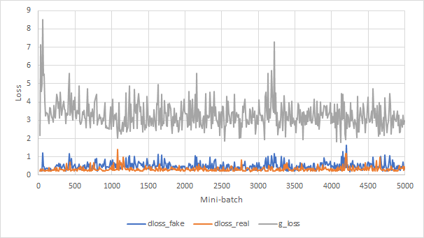

# Keras-GAN-Animeface-Character

GAN example for Keras. Cuz MNIST is too small and there
should an example on something more realistic.

## Some results

### Training for 22 epochs

Youtube Video, click on the image

### Loss graph for 5000 mini-batches

1 mini-batch = 64 images.
Dataset = 14490, hence 5000 mini-batches is approximately 22 epochs.

### Some outputs of 5000th min-batch

### Some training images

## Useful resources, before you go on

* There are great examples on MNIST already. Be sure to check them out.
    * https://oshearesearch.com/index.php/2016/07/01/mnist-generative-adversarial-model-in-keras/
    * https://github.com/osh/KerasGAN
    * https://medium.com/towards-data-science/gan-by-example-using-keras-on-tensorflow-backend-1a6d515a60d0
* "How to Train a GAN? Tips and tricks to make GANs work" is a must read! (GAN Hacks)
    * The advice was very helpful in making this example.
    * https://github.com/soumith/ganhacks
* Projects doing the same thing:
    * https://github.com/jayleicn/animeGAN
    * https://github.com/tdrussell/IllustrationGAN
* I used slow implementation for the sake of simplicity. However, the correct way is:
    * https://ctmakro.github.io/site/on_learning/fast_gan_in_keras.html
* https://github.com/shekkizh/neuralnetworks.thought-experiments/blob/master/Generative%20Models/GAN/Readme.md

## How to run this example

### Setup
* My environment: Python 3.6 + Keras 2.0.4 + Tensorflow 1.x
    * If you are on Keras 2.0.0, you need to update it otherwise BatchNormalization() will
      cause bug, saying "you need to pass float to input" or something
      like that from Tensorflow back end.
* I HATE making a program that has so many command line parameters to pass.
  Many of the parameters are there in the scripts. Adjust the script as you need.
  The "main()" function is at the bottom of the script as people do in C/C++
* Most global parameters are defined in args.py.
    * They are defined as class variables not instance variables so you may have trouble
      running/training multiple instances of the GAN with different parameters.
      (which is very unlikely to happen)
* Download dataset from http://www.nurs.or.jp/~nagadomi/animeface-character-dataset/
    * Extract it to this directory so that the scipt can find
      ./animeface-character-dataset/thumb/
    * Any dataset should work in principle but GAN is sensitive to hyperparameters and may not work
      on yours. I tuned the parameters for animeface-character-dataset.

### Preprocessing
* Run the preprocessing script. It saves training time to resize/scale the input than
  doing those tasks on the fly in the training loop.
    * ./data.py
    * Data.py will only sample a subset of the dataset. The size of the subset is determined
      by dataset_sz defined in args.py
    * data.py will resize the input to 32x32 (=sz defined in args.py) and dump them in data.hdf5.
        * Made it small to verify the training is working.
        * You can increase it but you need to adjust the network sizes accordingly.
    * Again, which files to read is defined in the script at the bottom, not by sys.argv.
* You need a large enough dataset. Otherwise the discriminator will sort of "memorize"
  the true data and reject all that's generated.

### Training
* Open gan.py then at the bottom, uncomment train\_autoenc() if you wish.
    * This is useful for seeing the generator network's capability to reproduce the input.
    * The auto-encoder will be trained on input images.
    * The output will be blurry, as the auto-encoder having mean-squared-error loss.
      (This is why GAN got invented in the first place!)
* To run training, modify main() so that train\_gan() is uncommented.
* The script will dump reals.png and fakes.png every 10 epoch so that you can see
  how the training is going.
* The training takes a while. For this example on Anime Face dataset, it took about 10000 mini-batches
  to get good results.
    * If you see only uniform color or "modern art" until 2000 then the training is not working!
* The script also dumps weights every 10 batches. Utilize them to save training time.
  Weights before diverging is preferred :)
  Uncomment load\_weights() in train\_gan().

### Training tips
What I experienced during my training of GAN.
* As described in GAN Hacks, discriminator should be ahead of the generator so that
  the generator can be "guided" by the discriminator.
* If you look at loss graph at https://github.com/osh/KerasGAN,
  they had gen loss in range of 2 to 4. Their training worked well.
  The discriminator loss is low, arond 0.1.
* You'll need trial and error to get the hyper-pameters right
  so that the training stays in the stable, balanced zone.
  That includes learning rate of D and G, momentums, etc.
* The convergence is quite sensitive with LR, beware!
* If things go well, the discriminator loss for detecting real/fake = dloss0/dloss1 should
  be less than or around 0.1, which means it is good at telling whether the input is real or fake.
* If learning rate is too high, the discriminator will diverge and
  one of the loss will get high and will not fall. Training fails in this case.
* If you make LR too small, it will only slow the learning and will not prevent other issues
  such as oscillation. It only needs to be lower than certain threshold that is data dependent.
* If adjusting LR doesn't work, it could be lack of complexity in the discriminator layer.
  Add more layers, or some other parameters. It could be anything :( Good luck!
* On the other hand, generator loss will be relatively higher than discriminator loss.
  In this script, it oscillates in range 0.1 to 4.
* If you see any of the D loss staying > 15 (when batch size is 32) the training is screwed.
* In case of G loss > 15, see if it escapes within 30 batches.
  If it stays there for too long, it isn't good, I think.
* In case you're seeing high G loss, it could mean it can't keep up with discriminator.
  You might need to increase LR. (Must be slower than discriminator though)
* One final piece of the training I was missing was the parameter in BatchNormalization.
  I found about it in this link:
  https://github.com/shekkizh/neuralnetworks.thought-experiments/blob/master/Generative%20Models/GAN/Readme.md
